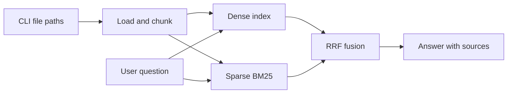

# Hybrid RAG

> **Work in progress** — This project is under active development. Features described below are planned or partially implemented; the CLI and full pipeline are not ready for use yet.

A command-line **hybrid Retrieval-Augmented Generation (RAG)** system. You pass **external documents as file paths** on the command line; the app ingests them, indexes them with both semantic and keyword search, and answers questions using retrieved context.

## What it will do

1. **Ingest** — Load files (PDF, TXT, MD, CSV, and more) from paths you provide via CLI arguments.
2. **Index** — Build two indexes over the same chunks:
   - **Dense** — Embeddings stored in Chroma (semantic similarity).
   - **Sparse** — BM25 (keyword / lexical matching).
3. **Query** — Retrieve from both, fuse rankings (Reciprocal Rank Fusion), and generate an answer with source citations.



## Planned CLI usage

*Not available until implementation is complete.*

```bash
# Build index from your documents
python -m src.cli ingest --paths path/to/doc.pdf notes.txt

# Ask a question against the saved index
python -m src.cli query --query "Your question here"
```

## Project layout (target)

```
Hybrid-rag/
├── README.md
├── requirements.txt
├── data/                 # sample documents (planned)
└── src/
    ├── cli.py            # entry point (in progress)
    ├── ingest/           # loaders, chunking (planned)
    ├── index/            # dense + sparse stores (planned)
    ├── retrieve/         # hybrid retrieval + fusion (planned)
    └── rag/              # pipeline + generation (planned)
```

## Setup (early)

Requires **Python 3.10+**.

```bash
# From the project root
python -m venv .venv

# Windows
.venv\Scripts\activate

# Install dependencies (list may grow as the project develops)
pip install -r requirements.txt
```

### Current dependencies

| Package | Purpose |
|---------|---------|
| `langchain-text-splitters` | Document chunking |
| `pypdf` | PDF text extraction |
| `chromadb` | Vector store (dense retrieval) |
| `rank-bm25` | Sparse BM25 retrieval |

Additional packages (e.g. embedding models, LLM client) will be added as retrieval and generation are implemented.

## Roadmap

- [ ] Document loaders and chunking
- [ ] `ingest` CLI command and persisted index
- [ ] Dense (Chroma) + sparse (BM25) indexing
- [ ] Hybrid retrieval with RRF fusion
- [ ] `query` CLI command with LLM and source citations
- [ ] Sample data and end-to-end smoke tests

## Status

| Area | Status |
|------|--------|
| README / project docs | In progress |
| `requirements.txt` | Initial list |
| `src/cli.py` | Stub only |
| Ingest, index, retrieve, RAG pipeline | Not started |

Contributions and feedback are welcome while the project is being built out.

## License

To be decided.
